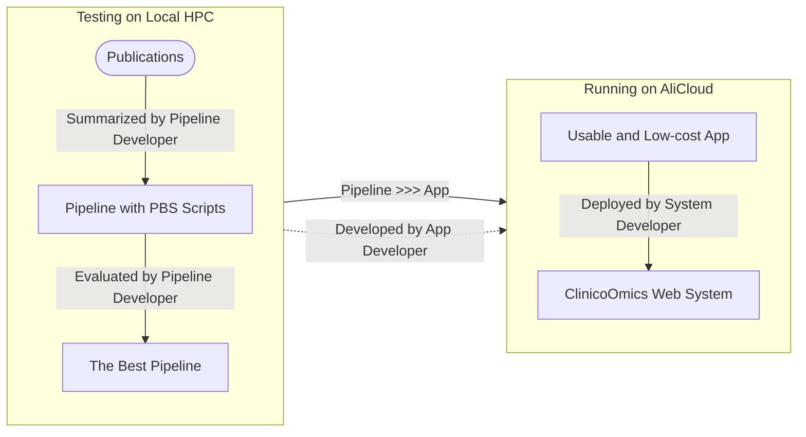
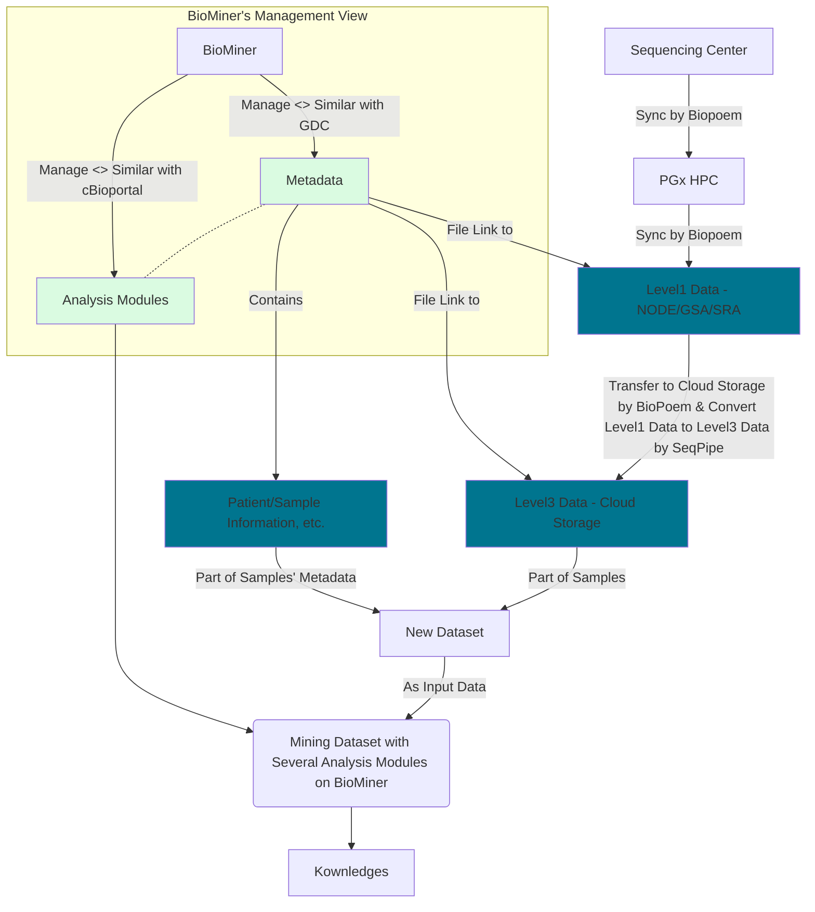

# BioMiner Project
BioMiner is dedicated to building a data mining platform that integrates high-quality multi-omics data management, distribution and exploratory analysis.

## For Users
Please access [the DataHub System](http://datahub.3steps.cn) to analyze and get omics data.

## For Dataset Reviewers

### [Datahub for The Cancer Omics Atlas](https://github.com/biominer-lab/datahub)

The Datahub repository is used to manage the metadata and specifications for the TCOA project.

```
目录说明：
|- .github                   -> 存放持续集成与持续发布相关脚本文件，当仓库数据文件更新时触发系统将Metadata自动更新至Metabase
|- data                      -> 存放数据集关联的Metadata（每个项目一个子文件夹，每个子文件夹中包含若干实体描述文件，如project.csv，sample.csv等，具体参考规范文档）
|    |- FUSCC_LUAD
|    |       |- project.csv
|    |       |- ...
|    |       |- README.md
|    |- FUSCC_TNBC
|    |- FUSCC_CBCGA
|- docs                      -> 存放规范文档，含字段声明、管理模式、更新要求等
|- README.md                 -> 快速指南
|- CHANGELOG                 -> 数据集版本变更说明
|- LICENSE                   -> 版权声明文件
```

### [SEQC DataHub for Quality Control](https://github.com/biominer-lab/seqc-datahub)

The SEQC Datahub repository is used to manage the metadata and specifications for the SEQC project.

```
目录说明：
|- .github/                          -> 存放持续集成与持续发布相关脚本文件，当仓库数据文件更新时触发系统将Metadata自动更新至Metabase
|- data/                             -> 存放数据集关联的Metadata表格文件（每个项目一个子文件夹，每个子文件夹中包含若干实体描述文件，具体参考规范文档）
|    |- <标准物质名称>_RNA/
|    |       |- project/
|    |       |- donor/
|    |       |- biospecimen/
|    |       |- reference_materials/
|    |       |- library/
|    |       |- sequencing/
|    |       |- datafile/
|    |       |- README.md
|    |       |- CHANGELOG
|- docs/                             -> 存放规范文档，含字段声明、管理模式、更新要求等
|- README.md                         -> 快速指南
|- CHANGELOG                         -> 数据集版本变更说明
|- LICENSE                           -> 版权声明文件
```

### [cbioportal-datahub](https://github.com/biominer-lab/cbioportal-datahub)

## For Pipeline Developers



## For System Developers

The whole system mainly consists of the following parts：Omics Datasets' Repo, Metadata QC & QA System, Workflows & Bioinformatics Workflow Management System, Omics Data Commons(Similar to Genomics Data Commons), A Web Platform for Collaborative Multi-omic Data Visualization and Exploration(Simimar to cBioportal).

| Components | Temporary Solution | Production |Description|
|------------|:----------:|:------------------:|-------------------------|
| Omics Datasets' Repo | [TCOA DataHub](https://github.com/biominer-lab/datahub)<br/>[SEQC DataHub](https://github.com/biominer-lab/seqc-datahub)  |   Same as the Temporary Solution   | GitHub Repo, For Metadata Collaboration and Version Control|
| Metadata QC & QA System | [Metabase](https://github.com/yjcyxky/metabase)<br/>[Metadata Validator](https://github.com/yjcyxky/metadata-tool) |   Same as the Temporary Solution   | For Metadata QC & QA |
| Workflows & Bioinformatics Workflow Management System | [ClinicoOmics](https://github.com/yjcyxky/clinico-omics) | Same as the Temporary Solution |For Bioinformatics Workflow Management |
| Omics Data Commons | [Metabase](https://github.com/yjcyxky/metabase)<br/>[BioPoem](https://github.com/yjcyxky/biopoem) | [BioMiner](https://github.com/yjcyxky/biominer)<br/>[BioPoem](https://github.com/yjcyxky/biopoem) |Metabase - For Metadata Management of the Omics Datasets<br/><br/>Biopoem - For High-speed Data Transfering(Sequencing Center ---> Local HPC ---> NODE ---> AliCloud/Local HPC)<br/><br/>NODE/GSA/SRA - For Level 1/2 Data Files<br/><br/>OSS - For Level3 Data Files |
| A Web Platform for Collaborative Multi-omic Data Visualization and Exploration | [cBioportal](https://github.com/yjcyxky/cbioportal)<br/>[cBioportal DataHub](https://github.com/biominer-lab/cbioportal-datahub)  | BioMiner |cBioportal - Omics Data Exploration<br/><br/>cBioportal DataHub - 维护符合cBioportal规范要求的数据集<br/><br/>BioMiner - 多组学数据下游分析，支持两种分析模式：① 在线查询与实时探索分析（类似于cBioportal）② 统计与机器学习模块|


