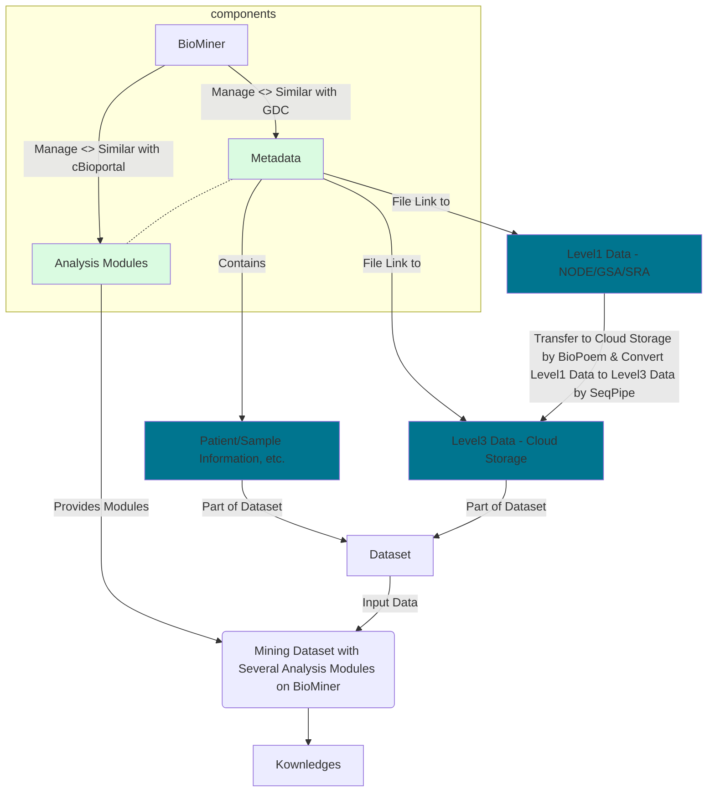

## BioMiner计划
致力于打造一套集肿瘤多组学数据管理、分发与探索分析于一体的数据挖掘平台。主要包含以下组成部分：肿瘤多组学数据集、元数据QC & QA系统、标准化分析流程与系统、多组学数据管理系统（类似于Genomics Data Commons）、多组学数据探索分析系统（类似于cBioportal）

### 过渡期

| 所属组成部分 | 软件系统  | 功能描述                  |
|------------|----------|-------------------------|
| 肿瘤多组学数据集 | [DataHub (GitHub仓库)](https://github.com/biominer-lab/datahub)  | 肿瘤多组学数据集管理       |
| 元数据QC & QA系统 | Metabase | 元数据QC/QA |
| 标准化分析流程与系统 | SeqPipe  | 原名Choppy Pipe, 标准化分析流程管理与运行 |
| 多组学数据管理系统 | Metabase + BioPoem + NODE/GSA/SRA + OSS | 多组学数据管理，Metabase - 元数据管理；Biopoem - 数据高速传输；NODE/GSA/SRA - Level 1/2数据的存储；OSS - Level3数据的存储; |
| 多组学数据探索分析系统| cBioportal + [cBioportal DataHub](https://github.com/biominer-lab/cbioportal-datahub)  | cBioportal - 探索分析；cBioportal DataHub - 维护符合cBioportal规范要求的数据集 |


### 生产期

| 所属组成部分 | 软件系统  | 功能描述                  |
|------------|----------|-------------------------|
| 肿瘤多组学数据集 | [DataHub (GitHub仓库)](https://github.com/biominer-lab/datahub)  | 肿瘤多组学数据集管理       |
| 元数据QC & QA系统 | Metabase | 元数据QC/QA |
| 标准化分析流程与系统 | SeqPipe  | 原名Choppy Pipe, 标准化分析流程管理与运行 |
| 多组学数据管理系统 | BioMiner + BioPoem (NODE/GSA/SRA + OSS) | BioMiner - 统一管理所有数据集（类似于GDC）；Biopoem - 数据高速传输；NODE/GSA/SRA - Level 1/2数据的存储；OSS - Level3数据的存储; |
| 多组学数据探索分析系统| BioMiner  | 多组学数据下游分析，支持两种分析模式：① 在线查询与实时探索分析（类似于cBioportal）；② 统计与机器学习模块； |



## 肿瘤多组学数据集

### [datahub](https://github.com/biominer-lab/datahub)
Datahub仓库用于管理本组织收集整理的数据集的Metadata及制定的字段规范文档等。

```
目录说明：
|- .github                   -> 存放持续集成与持续发布相关脚本文件，当仓库数据文件更新时触发系统将Metadata自动更新至Metabase
|- data                      -> 存放数据集关联的Metadata（每个项目一个子文件夹，每个子文件夹中包含若干实体描述文件，如project.csv，sample.csv等，具体参考规范文档）
|    |- FUSCC_LUAD
|    |       |- project.csv
|    |       |- ...
|    |       |- README.md
|    |- FUSCC_TNBC
|    |- FUSCC_CBCGA
|- docs                      -> 存放规范文档，含字段声明、管理模式、更新要求等
|- README.md                 -> 快速指南
|- CHANGELOG                 -> 数据集版本变更说明
|- LICENSE                   -> 版权声明文件
```

### [cbioportal-datahub](https://github.com/biominer-lab/cbioportal-datahub)


## 质控相关多组学数据集

### [seqc-datahub](https://github.com/biominer-lab/seqc-datahub)

SEQC Datahub仓库用于管理本组织收集整理的多组学质量控制相关数据集及制定的数据管理规范文档等

```
目录说明：
|- .github/                          -> 存放持续集成与持续发布相关脚本文件，当仓库数据文件更新时触发系统将Metadata自动更新至Metabase
|- data/                             -> 存放数据集关联的Metadata表格文件（每个项目一个子文件夹，每个子文件夹中包含若干实体描述文件，具体参考规范文档）
|    |- <标准物质名称>_RNA/
|    |       |- project/
|    |       |- donor/
|    |       |- biospecimen/
|    |       |- reference_materials/
|    |       |- library/
|    |       |- sequencing/
|    |       |- datafile/
|    |       |- README.md
|    |       |- CHANGELOG
|- docs/                             -> 存放规范文档，含字段声明、管理模式、更新要求等
|- README.md                         -> 快速指南
|- CHANGELOG                         -> 数据集版本变更说明
|- LICENSE                           -> 版权声明文件
```

<!--

**Here are some ideas to get you started:**

🙋‍♀️ A short introduction - what is your organization all about?
🌈 Contribution guidelines - how can the community get involved?
👩‍💻 Useful resources - where can the community find your docs? Is there anything else the community should know?
🍿 Fun facts - what does your team eat for breakfast?
🧙 Remember, you can do mighty things with the power of [Markdown](https://docs.github.com/github/writing-on-github/getting-started-with-writing-and-formatting-on-github/basic-writing-and-formatting-syntax)
-->
